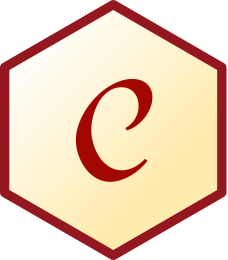
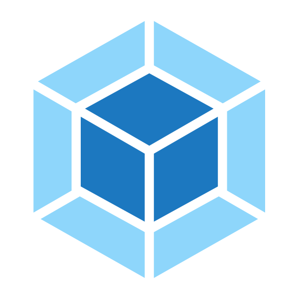

<!-- DEXDUX README -->
# DevDux README
<!-- PROJECT LOGO -->
 

  

  <h3 align="center">DexDux</h3>

  

    Redux Toolkit state visualization extension for VS Code
     
    <a href="https://github.com/oslabs-beta/DevDux"><strong>Explore the docs »</strong></a>
     
     
    <a href="https://github.com/oslabs-beta/DevDux/issues">Report Bug</a>
    ·
    <a href="https://github.com/oslabs-beta/DevDux/issues">Request Feature</a>
  

    <!-- BADGES -->
  <!-- 
 -->
    <!-- VSCode Version -->
    <!--  -->
    <!-- VSCode Installs -->
    <!--  -->
    <!-- STARS -->
    <!--  -->
    <!-- FORKS -->
    <!--  -->
    <!-- GITHUB RELEASE VERSION -->
    <!--  -->
    <!--   -->
    <!-- BUILD STATUS -->
    <!-- 
    
     -->
    <!-- LICENSE -->
    <!--  -->
    <!-- CONTRIBUTIONS -->
    <!--  -->
  

<!-- TABLE OF CONTENTS -->

  
Table of Contents

  <ol>
    <li>
      <a href="#about-the-project">About The Project</a>
      <ul>
        <li><a href="#built-with">Built With</a></li>
      </ul>
    </li>
    <li><a href="#installation">Installation</a></li>
    <li>
      <a href="#getting-started">Getting Started</a></li>
    <li><a href="#usage">Usage</a>
    <li><a href="#limitations">Limitations</a>
    <li><a href="#contributor-usage">Contributor Usage</a></li>
    <li><a href="#extension-settings">Extension Settings</a></li>
    <li><a href="#contributing">Contributing</a></li>
    <li><a href="#license">License</a></li>
    <li><a href="#creators">Creators</a></li>
    <li><a href="#contact">Contact</a></li>
    <li><a href="#acknowledgements">Acknowledgements</a></li>
  </ol>

## About The Project

  <!--  add gif here -->

 

DexDux is a VS Code extention built for Redux users. As a codebase grows, it gets difficult to keep track of what files are rendering which components, what props are being passed, and the relationship between it all. Wouldn't it be so easy if we could just see everything displayed in a single spot?

The solution is DevDux. DevDux eliminates the need of visiting files just to figure out how everything relates to one another. There is no more guessing of what the parent component is to your current file. DevDux is an interactive hierarchical tree view visualizer that lives directly in VS Code. It provides a visual indication of what each file contains.

### Built With

-  [React](https://reactjs.org/)
-  [VSCode Extension API](https://code.visualstudio.com/api)
-  [Mocha](https://mochajs.org/)
-  [Chai](https://www.chaijs.com/)
-  [Babel Parser](https://babeljs.io/docs/en/babel-parser)
-  [Webpack](https://webpack.js.org/)

## Installation

Installation from VS Code Extension Marketplace:

1. If needed, install Visual Studio Code for macOS (Sierra+). Currently 'DevDux' only supports macOS.

2. Install the DevDux extension for Visual Studio Code. Search for 'DexDux' in the VS Code extensions tab, or click [here](https://marketplace.visualstudio.com/items?itemName=DevDux.DevDux).

3. Once installed the DevDux "Open Root File" command should be accesible via the command pallete. See getting started for more information.

To install devdux for development, please see the contributing section below.

## Getting Started

1. After installing DevDux, open the VS Code command pallete (⌘⇧P). Type in the command "DevDux: Open Root File".

2. Your file explorer window will launch. Select an entrypoint. This is typically a file where the parent component for the rest of your application is rendered (App.jsx).

3. Go to the VS Code Explorer tab (⌘⇧E) and a DevDux Sidebar will be presented below your files.

## Usage
Currently DevDux supports a limited amount of React-Redux file structures, see the limitations sections for more details. DevDux the name of the folder a file resides in and the file name. Clicking on a file name opens the collapsable tree view to reveal the following application information :
<ol>
  <li> filePath </li>
  <ul>
    <li>Complete file path </li>
  </ul>
  <li> imports </li>
  <li> selected </li>
  <li> dispatched </li>
  <li> rendered components</li>
</ol>
1. filePath
1. imports
1. selected
1. dispatched
1. renderedComponents

## Limitations

### Contributor Usage

## Extension Settings

## Contributing

The open source community thrives on contributions. It allows developers to learn, create, and inspire others. Contributions to DevDux are **appreciated** and **encouraged**.

1. Fork the Project
2. Create your Feature Branch (`git checkout -b feature/newFeature`)
3. Commit your Changes (`git commit -m 'Add some newFeature'`)
4. Push to the Branch (`git push origin feature/newFeature`)
5. Open a Pull Request

## License
This project is licensed under the Mozilla Public License. For more information see the LICENSE file in the repository or visit Mozilla's offical page [here](https://www.mozilla.org/en-US/MPL/).
## Creators

- [Kara Chisholm](https://github.com/kkchis)
- [Hina Khalid](https://github.com/hina-khalid)
- [Josh Miller](https://github.com/jshbmllr)
- [Matt Garza](https://github.com/mattg614)

## Contact

 LinkedIn: [@devdux-extension](https://www.linkedin.com/company/devdux-extension/) | Email: devduxExtension@gmail.com

 GitHub: [https://github.com/oslabs-beta/devdux/](https://github.com/oslabs-beta/devdux/)

## Acknowledgements
