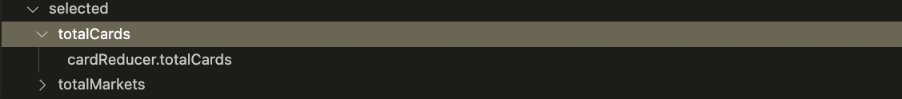

<!-- DEXDUX README -->

## DevDux README

<!-- PROJECT LOGO -->
 

  

  <h1 align="center">DexDux</h1>

  

    DexDux is a VS Code extention built for Redux Toolkit users. As the codebase grows, it gets difficult to track and conceptualize what files are rendering which components, what props are passed, and the relationship between it all. Wouldn't it be so easy if we could just see everything displayed in a single spot? 
  
 
    The solution is DevDux. DevDux eliminates the need of visiting files just to figure out how everything relates to one another.  It provides a visual indication of everything a file contains. 
     
    <a href="https://github.com/oslabs-beta/DevDux"><strong>Explore the docs »</strong></a>
     
     
    <a href="https://github.com/oslabs-beta/DevDux/issues">Report Bug</a>
    ·
    <a href="https://github.com/oslabs-beta/DevDux/issues">Request Feature</a>
  

  

  

<!-- TABLE OF CONTENTS -->

  
Table of Contents

  
  <ol>
    <li>
      <a href="#about-the-project">DevDux
      </a>
      <ul>
        <li><a href="#technologies-used">Technologies Used</a>
        </li>
      </ul>
    </li>
    <li><a href="#installation">Installation</a>
    </li>
    <li>
      <a href="#getting-started">Getting Started</a></li>
    <li>
    <a href="#about-the-extension">About the Extension
    </a>
    <ul>
    <li><a href="#limitations">Limitations</a>
    </ul>
    <li>
      <a href="#Contributions">Contributions</a>
      <ul>
        <li><a href="#howToContribute">Make a contribution</a></li>
      </ul>
    <li><a href="#license">License</a></li>
    <li><a href="#creators">Creators</a></li>
    <li><a href="#contact">Contact</a></li>
    <!-- <li><a href="#acknowledgements">Acknowledgements</a></li> -->
  </ol>

## DevDux 

  

 

### Technologies Used

-  [VSCode Extension API](https://code.visualstudio.com/api)
-  [React](https://reactjs.org/)
-  [Babel Parser](https://babeljs.io/docs/en/babel-parser)
-  [Mocha](https://mochajs.org/)
-  [Chai](https://www.chaijs.com/)
-  [Webpack](https://webpack.js.org/)

### Installation

Installation from VS Code Extension Marketplace:

1. If needed, install Visual Studio Code for macOS (Sierra+). Currently 'DevDux' only supports macOS.

2. Install the DevDux extension for Visual Studio Code. Search for 'DexDux' in the VS Code extensions tab, or click [here](https://marketplace.visualstudio.com/items?itemName=DevDux.DevDux).

3. Once installed the DevDux "Open Root File" command should be accesible via the command pallete. See getting started for more information.

To install devdux for development, please see the contributing section below.

  
## Getting Started

1. After installing DevDux, open the VS Code command pallete (⌘⇧P). Type in the command "DevDux: Open Root File".

2. Your file explorer window will launch. Select an entrypoint. This is typically a file where the parent component for the rest of your application is rendered (App.jsx).

3. Go to the VS Code Explorer tab (⌘⇧E) and a DevDux Sidebar will be presented below your files.
     
   

  
## About the Extension

Currently DevDux supports a limited amount of React-Redux file structures, see the limitations sections for more details. DevDux the name of the folder a file resides in and the file name. Clicking on a file name opens the collapsable tree view to reveal the following application information :

<ol>
  <li> filePath </li>
  <ul>
    <li>Complete file path for the file you have selected</li>
    
  </ul>
  <li> imports </li>
    <ul>
      <li>Displays a list of named items imported in the selected file</li>
      <li>Selecting a name opens the file path for the selected item</li>
      
    </ul>
  <li> selected </li>
    <ul>
      <li>Displays a list of state variables pulled from the store</li>
      <li>Parser searches for useSelector or useAppSelector</li>
      <li>The list is based on what the store variables are labeled as in the file</li>
      <li>Selecting a variable label displays the reducer that the state variable is defined in and the state label</li>
      
    </ul>
  <li> dispatched </li>
    <ul>
      <li>Displays a list of dispatched functions pulled from the store via parsing for occurrences of useDispatch or useAppDispatch</li>
      
    </ul>
  <li> rendered components</li>
    <ul>
      <li>Displays a list of components that are rendered in this component file</li>
      <li>Selecting a componenet displays a list of the props that are passed to the rendered component</li>
      <li>Selecting a prop displays the value that is passed in as the prop</li>
      
    </ul>
</ol>

  
## Limitations

DevDux in its current version is limited in scope and opionionated. This section serves to describe some of DevDux limitations and best practices to ensure DevDux works properly. Currently MacOS is supported for use of DevDux. Currently the following React-Redux file structures are supported:

1.  Functional components using ES6 arrow function definition that is exported seperately.
1.  Functional components defined using traditonal function declaration and exported in place.
1.  Functional component defined using a function definition inside of a React.memo top level API call that is exported in place.

  
## Contributions

Our team **welcomes**, **appreciates**, and **encourages** contributions. Contributions make the the open source community thrive. Building new features in DevDux will allow developers to learn the exsisting codebase, create new features, and inspire others. 

### How to make a contribution
1. Fork the Project
2. Create your Feature Branch (`git checkout -b feature/newFeature`)
3. Commit your Changes (`git commit -m 'Add some newFeature'`)
4. Push to the Branch (`git push origin feature/newFeature`)
5. Open a Pull Request

  
## Reporting Issues

Report bugs [here](https://github.com/oslabs-beta/DevDux/issues). When possible provide a screen shot of the item that is not being displayed. Report the following:

1. Type of React component (Class Based, Functional Definition, Arrow function definition)
1. Location where component was exported. In place or a seperate location.
1. Information relavant to the item that is not being displayed. What was missing/not displayed? Where is the item located that is not being displayed with relation to the rest of the file.

  
## License

This project is licensed under the Mozilla Public License. For more information see the [`LICENSE`](https://github.com/oslabs-beta/DevDux/blob/main/devdux/LICENSE) file in the repository or visit Mozilla's offical page [here](https://www.mozilla.org/en-US/MPL/).

  
## Creators

- [Kara Chisholm](https://github.com/kkchis)
- [Hina Khalid](https://github.com/hina-khalid)
- [Josh Miller](https://github.com/jshbmllr)
- [Matt Garza](https://github.com/mattg614)

## Contact

 LinkedIn: [@devdux-extension](https://www.linkedin.com/company/devdux-extension/) | Email: devduxExtension@gmail.com

 GitHub: [https://github.com/oslabs-beta/devdux/](https://github.com/oslabs-beta/devdux/)